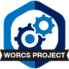

# Readme 

This study reports a facial electromyography experiment with participants reading short stories divided into segments while corrugator (frowning musclie) activity was measured. This repository contains all analysis scripts, as well as the (intermediate) data files. The raw data can be found in our online Yoda repository. All other experimental materials and scripts can be found on our OSF repository.

## Where do I start?

You can load this project in RStudio by opening the file called 'WORCS_EMG4.Rproj'.

## Project structure

File                      | Description                            | Usage         
------------------------- | -------------------------------------- | --------------
README.md                 | Description of project                 | Human editable
README_ANALYSIS.md        | Description of analysis process        | Human editable
WORCS_EMG4.Rproj          | Project file                           | Loads project 
LICENSE                   | User permissions                       | Read only     
.worcs                    | WORCS metadata YAML                    | Read only     
preregistration.rmd/pdf   | Preregistered hypotheses               | Human editable
EMG4_*.rmd/pdf            | analysis scripts, see README_ANALYSIS  | Human editable
EMG4_template.docx        | Word template for pdf knit of rmd      | Human editable
data/                     | Folder with data for analysis          | Human editable
images/                   | Folder with figures of manuscript      | Human editable
results/                  | Folder with final models of analysis   | Human editable
renv.lock                 | Reproducible R environment             | Read only     

To cite this project, please visit our OSF repository: https://doi.org/10.17605/OSF.IO/UENMR

For any questions about this project, please contact Marijn Struiksma.

# Reproducibility

This project uses the Workflow for Open Reproducible Code in Science (WORCS) to
ensure transparency and reproducibility. The workflow is designed to meet the
principles of Open Science throughout a research project. 

To learn how WORCS helps researchers meet the TOP-guidelines and FAIR principles,
read the preprint at https://osf.io/zcvbs/

## WORCS: Advice for authors

* To get started with `worcs`, see the [setup vignette](https://cjvanlissa.github.io/worcs/articles/setup.html)
* For detailed information about the steps of the WORCS workflow, see the [workflow vignette](https://cjvanlissa.github.io/worcs/articles/workflow.html)

## WORCS: Advice for readers

Please refer to the vignette on [reproducing a WORCS project]() for step by step advice.
                                                          -->
